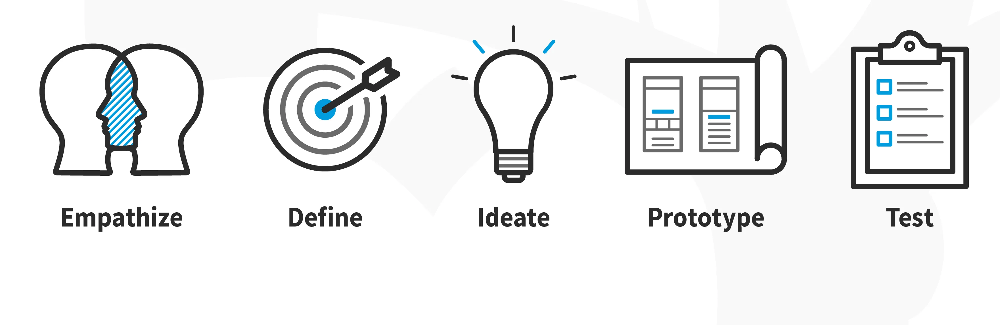

# **Design thinking:**

Design thinking is a human-centered approach to innovation. It is a method or process of global design, centered on the user (or the human), with a view to creating innovative services or products.

Empathy
Understanding the needs and perspectives of the users affected by the problem to be solved. This involves observing, listening to, and interacting with users to gain a deep understanding of their needs, motivations, and challenges.

Define the problem
Clearly define the problem to be solved based on the information gathered during the empathy phase. This involves formulating a specific question or challenge that will guide the design process.

Ideation
Generate a large number of creative ideas to address the identified problem. Encourage divergent thinking, where all ideas are welcome, without judgment, to foster the exploration of different possible solutions.

Prototype
Create tangible prototypes or visual representations of potential solutions. Prototypes can be simple and quick to make, but should be concrete enough to gather feedback and iterate on.

Test
Test prototypes with real users. The first models necessarily contain errors, which must be identified as quickly as possible and from which lessons must then be learned.
